# Modelos y mapas del proyecto corregidos

Este archivo contiene los modelos principales del proyecto. Se mantienen sencillos para que sean faciles de explicar y sustentar.

## 1. Mapa general del sistema

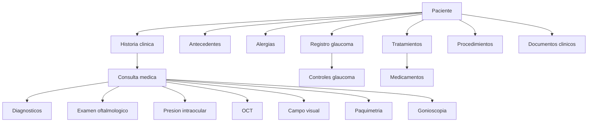

## 2. Modelo conceptual

El modelo conceptual muestra las entidades principales y sus relaciones sin entrar todavia en tipos de datos o detalles propios de MySQL.

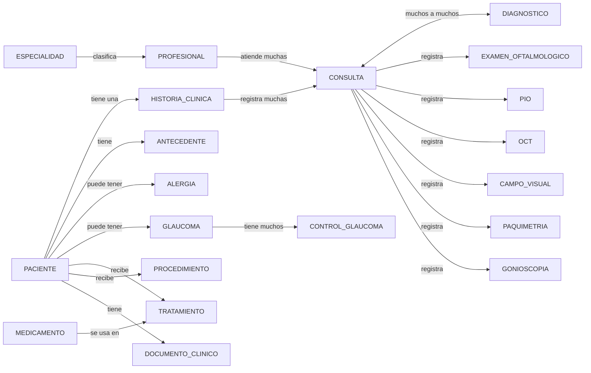

## 3. Modelo logico visual

El modelo logico muestra las tablas principales, sus claves primarias (PK), claves foraneas (FK) y la forma en que se conectan.

**Importante:** este modelo se divide en tres diagramas solamente para que pueda leerse bien en Typora y en la sustentacion. Los tres diagramas juntos forman un solo modelo logico.

### 3.1. Nucleo clinico

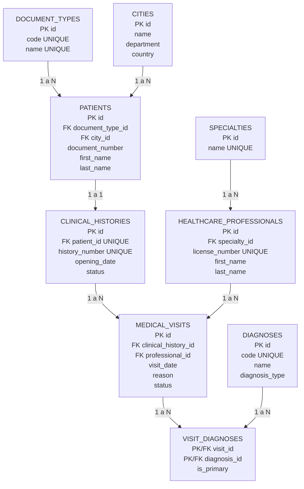

### 3.2. Antecedentes, alergias y examenes

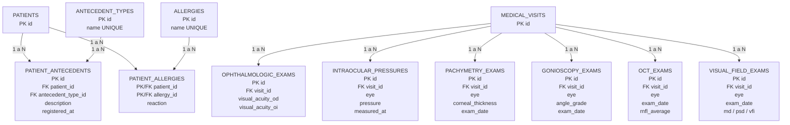

### 3.3. Glaucoma, tratamientos y soporte

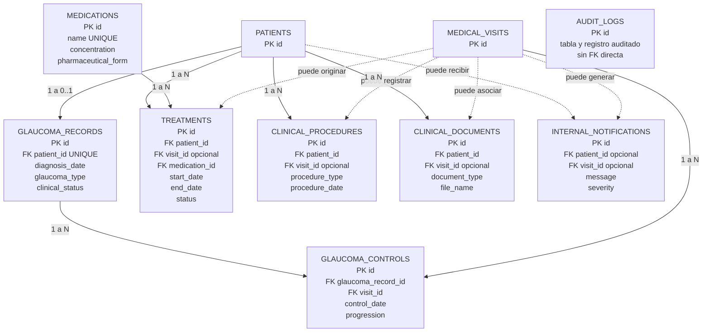

### 3.4. Esquema logico escrito

Este bloque se conserva como apoyo para revisar rapidamente las claves sin depender del grafico.

```text
DOCUMENT_TYPES(id PK, code UNIQUE, name UNIQUE)
CITIES(id PK, name, department, country)
PATIENTS(id PK, document_type_id FK, city_id FK, document_number UNIQUE con document_type_id, first_name, last_name, birth_date, sex, phone, email UNIQUE)
CLINICAL_HISTORIES(id PK, patient_id FK UNIQUE, history_number UNIQUE, opening_date, status)
SPECIALTIES(id PK, name UNIQUE)
HEALTHCARE_PROFESSIONALS(id PK, specialty_id FK, license_number UNIQUE, first_name, last_name, phone, email, active)
MEDICAL_VISITS(id PK, clinical_history_id FK, professional_id FK, visit_date, reason, assessment, plan, status)
DIAGNOSES(id PK, code UNIQUE, name, diagnosis_type, active)
VISIT_DIAGNOSES(visit_id PK/FK, diagnosis_id PK/FK, is_primary, notes)
ANTECEDENT_TYPES(id PK, name UNIQUE)
PATIENT_ANTECEDENTS(id PK, patient_id FK, antecedent_type_id FK, description, registered_at)
ALLERGIES(id PK, name UNIQUE)
PATIENT_ALLERGIES(patient_id PK/FK, allergy_id PK/FK, reaction)
OPHTHALMOLOGIC_EXAMS(id PK, visit_id FK, visual_acuity_od, visual_acuity_oi, slit_lamp_findings, fundus_findings, observations)
INTRAOCULAR_PRESSURES(id PK, visit_id FK, eye, pressure, measured_at, method)
PACHYMETRY_EXAMS(id PK, visit_id FK, eye, corneal_thickness, exam_date, interpretation)
GONIOSCOPY_EXAMS(id PK, visit_id FK, eye, angle_grade, pigmentation, exam_date, interpretation)
OCT_EXAMS(id PK, visit_id FK, eye, exam_date, rnfl_average, cup_disc_ratio, interpretation, validated)
VISUAL_FIELD_EXAMS(id PK, visit_id FK, eye, exam_date, md, psd, vfi, interpretation)
GLAUCOMA_RECORDS(id PK, patient_id FK UNIQUE, diagnosis_date, glaucoma_type, target_pressure_od, target_pressure_oi, clinical_status)
GLAUCOMA_CONTROLS(id PK, glaucoma_record_id FK, visit_id FK, control_date, optic_nerve_status, progression, next_control_date)
MEDICATIONS(id PK, name UNIQUE, concentration, pharmaceutical_form, active)
TREATMENTS(id PK, patient_id FK, visit_id FK opcional, medication_id FK, start_date, end_date, dosage, frequency, status)
CLINICAL_PROCEDURES(id PK, patient_id FK, visit_id FK opcional, procedure_type, procedure_date, eye, description)
CLINICAL_DOCUMENTS(id PK, patient_id FK, visit_id FK opcional, document_type, file_name, file_path, uploaded_at)
AUDIT_LOGS(id PK, table_name, record_id, action, old_value, new_value, changed_at, changed_by)
INTERNAL_NOTIFICATIONS(id PK, patient_id FK opcional, visit_id FK opcional, message, severity, created_at, read_at)
```

## 4. DER completo con cardinalidades

Para que las cardinalidades puedan leerse sin hacer zoom excesivo, el DER completo se presenta en tres partes. **No son tres modelos diferentes:** son tres vistas del mismo DER.

### 4.1. DER - nucleo clinico

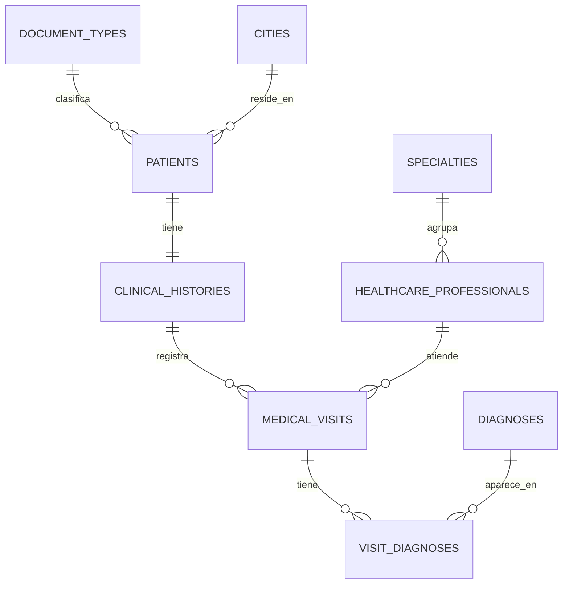

### 4.2. DER - antecedentes, alergias y examenes

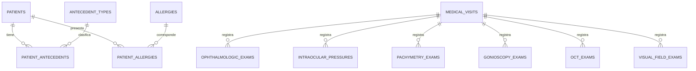

### 4.3. DER - glaucoma, tratamientos y soporte

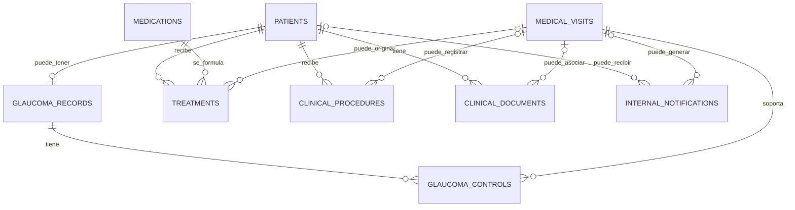

> `AUDIT_LOGS` se deja fuera de las lineas del DER porque guarda auditoria generica de varias tablas y no posee una clave foranea directa hacia una sola entidad.

## 5. DER completo con atributos principales

Este DER tambien se divide en partes para que los atributos puedan leerse claramente en Typora. Los campos secundarios siguen disponibles en el modelo logico escrito y en `01_ddl_corregido.sql`.

### 5.1. Atributos - pacientes, historias y consultas

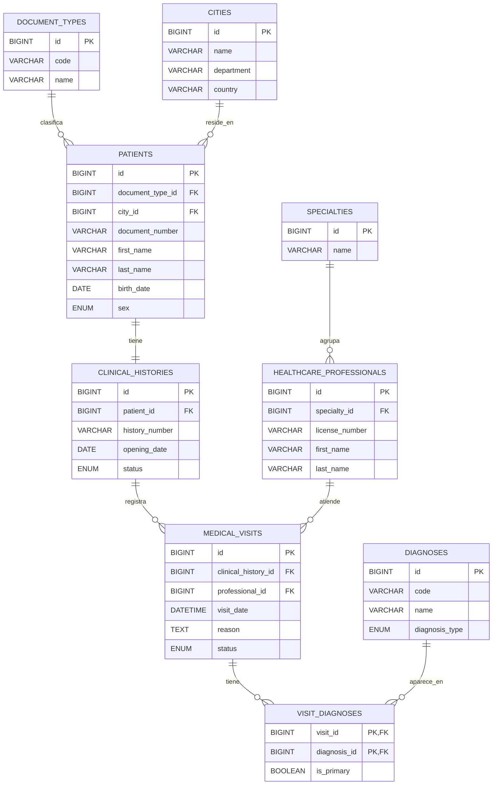

### 5.2. Atributos - antecedentes y alergias

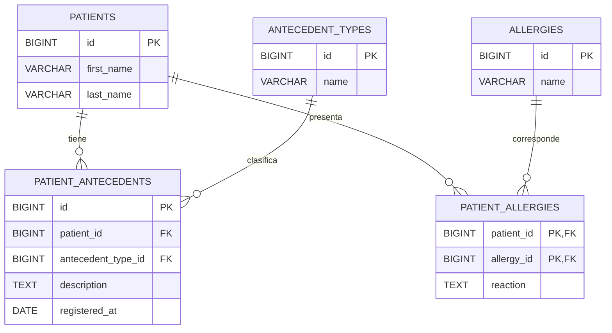

### 5.3. Atributos - examenes oftalmologicos

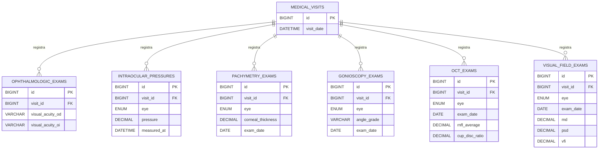

### 5.4. Atributos - glaucoma y tratamientos

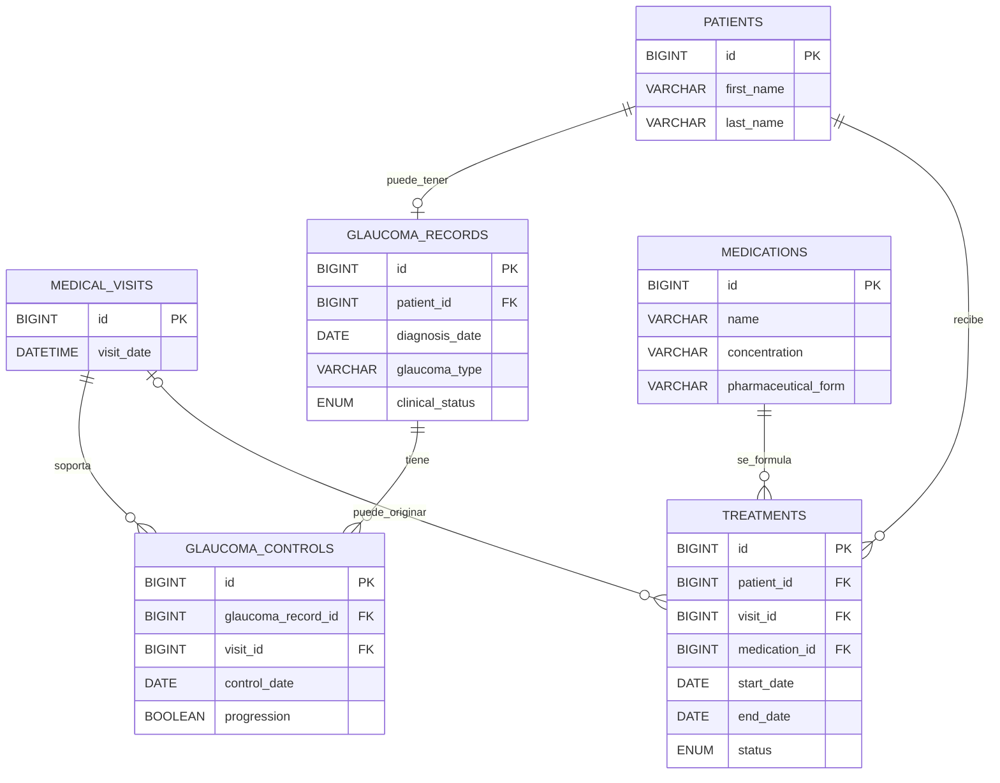

### 5.5. Atributos - procedimientos, documentos y notificaciones

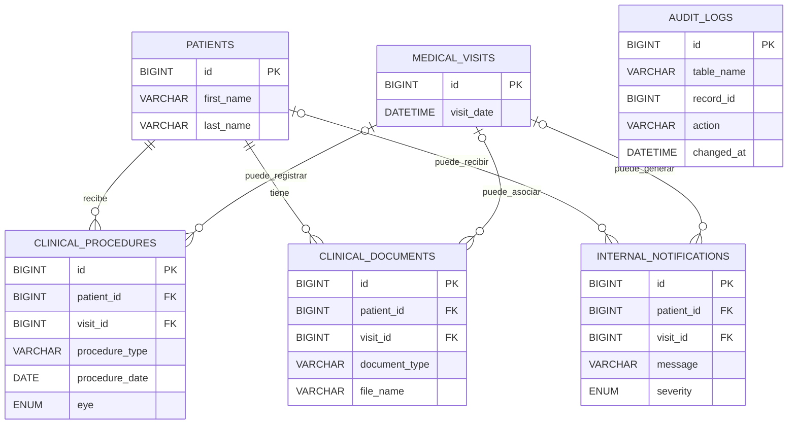

> `AUDIT_LOGS` aparece con sus atributos principales, pero sin una relacion grafica directa porque su diseño es de auditoria generica.

## 6. Modelo relacional resumido por relaciones

```text
DOCUMENT_TYPES 1 ----- N PATIENTS
CITIES 1 ------------- N PATIENTS
PATIENTS 1 ----------- 1 CLINICAL_HISTORIES
CLINICAL_HISTORIES 1 - N MEDICAL_VISITS
SPECIALTIES 1 -------- N HEALTHCARE_PROFESSIONALS
HEALTHCARE_PROFESSIONALS 1 - N MEDICAL_VISITS

MEDICAL_VISITS 1 ----- N VISIT_DIAGNOSES
DIAGNOSES 1 ---------- N VISIT_DIAGNOSES
Esto representa MEDICAL_VISITS N ----- N DIAGNOSES.

PATIENTS 1 ----------- N PATIENT_ANTECEDENTS
ANTECEDENT_TYPES 1 --- N PATIENT_ANTECEDENTS
PATIENTS 1 ----------- N PATIENT_ALLERGIES
ALLERGIES 1 ---------- N PATIENT_ALLERGIES

MEDICAL_VISITS 1 ----- N OPHTHALMOLOGIC_EXAMS
MEDICAL_VISITS 1 ----- N INTRAOCULAR_PRESSURES
MEDICAL_VISITS 1 ----- N PACHYMETRY_EXAMS
MEDICAL_VISITS 1 ----- N GONIOSCOPY_EXAMS
MEDICAL_VISITS 1 ----- N OCT_EXAMS
MEDICAL_VISITS 1 ----- N VISUAL_FIELD_EXAMS

PATIENTS 1 ----------- 0..1 GLAUCOMA_RECORDS
GLAUCOMA_RECORDS 1 --- N GLAUCOMA_CONTROLS
MEDICAL_VISITS 1 ----- N GLAUCOMA_CONTROLS

PATIENTS 1 ----------- N TREATMENTS
MEDICATIONS 1 -------- N TREATMENTS
PATIENTS 1 ----------- N CLINICAL_PROCEDURES
PATIENTS 1 ----------- N CLINICAL_DOCUMENTS
```

## 7. Mapa de normalizacion

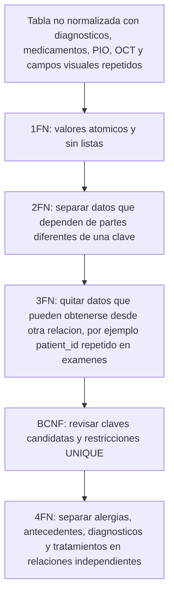

## 8. Idea principal para sustentar

La ruta principal del sistema es:

```text
PACIENTE -> HISTORIA CLINICA -> CONSULTA
```

Desde la consulta se registran los diagnosticos, examenes y mediciones. Por eso los estudios especializados solo necesitan `visit_id`: desde esa consulta se puede conocer la historia clinica y despues el paciente.

La relacion entre consultas y diagnosticos es muchos a muchos y se resuelve con la tabla intermedia `visit_diagnoses`.

Los antecedentes, alergias y tratamientos se mantienen separados porque un paciente puede tener varios valores de cada tipo y no deben almacenarse como listas dentro de `patients`.
